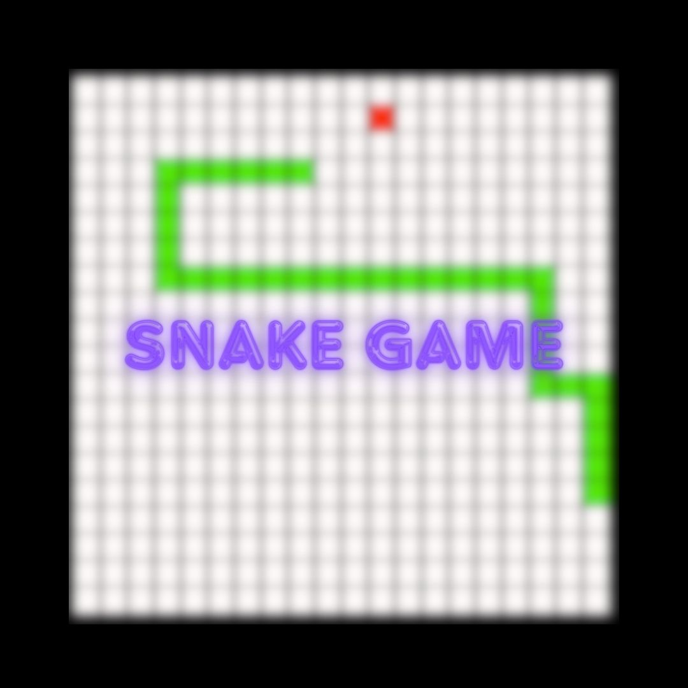

# 貪食蛇 Snake Game

> 基於 C++ 和 SFML(Simple and Fast Multimedia Library）製作

</img>

## 使用說明

1.先`clone`下來
```git=
git clone https://github.com/viiccwen/Snake-SFML.git
```

2. 進入clone下來的資料夾
3. 進入`release` 資料夾
4. 點擊`Snake Game.exe` 檔案
5. Have Fun！

## 更新紀錄
* v0.0.1 - 基礎功能佈建完成
* v0.0.2 - 新增計分功能、更新皮膚